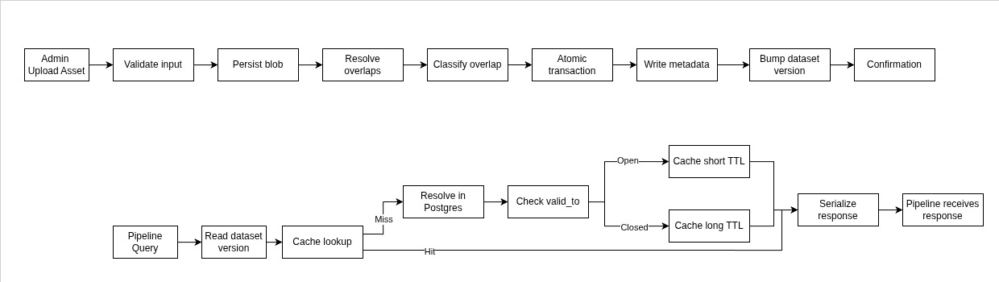
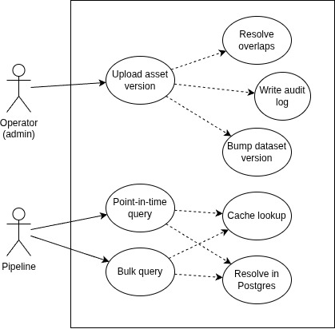
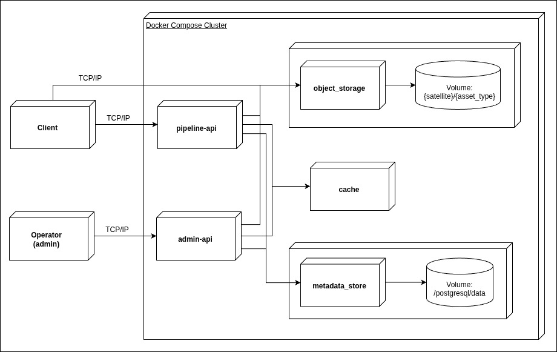
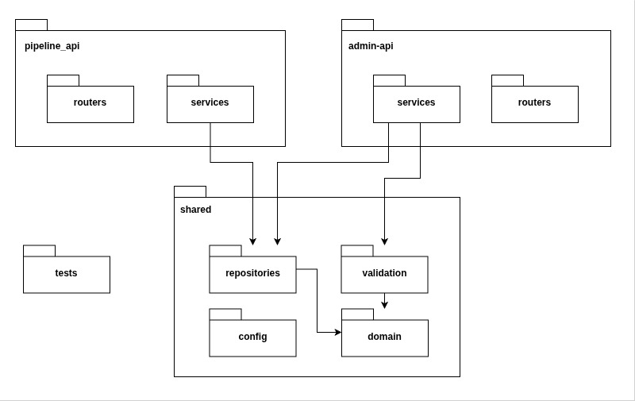
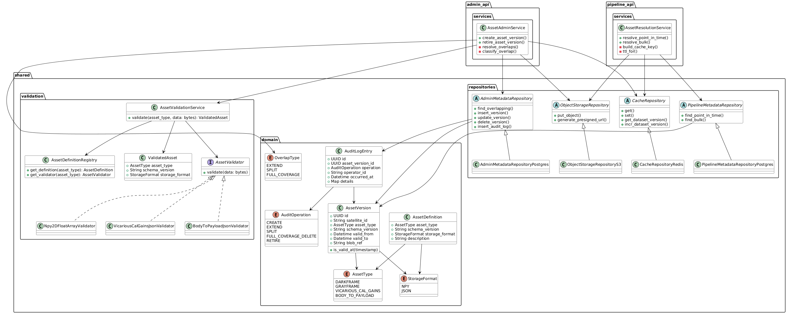

# SCAR — Satellite Calibration Asset Registry

SCAR is the single source of truth for calibration assets (`darkframe`, `grayframe`, `vicarious_cal_gains`, `body_to_payload`) across a satellite fleet. Each asset version has a temporal validity window `[valid_from, valid_to)`. The system exposes:

- An **admin interface** for operators to create, extend, and retire asset versions, atomically maintaining the no-overlap/no-gap invariant per `(satellite, asset_type)`.
- A **pipeline interface** optimized for high-throughput reads: point-in-time resolution (one asset type) and bulk resolution (all asset types for a satellite at a given timestamp).

## Overview

The two core flows — an admin uploading a new asset version, and a pipeline resolving a query — are summarized below as data flow diagrams. These motivate the architectural decisions detailed in the views that follow.

  

This document follows the **4+1 architectural view model**, separating the system into complementary perspectives:

- **Use Case View** — captures the interactions between operators, processing pipelines, and the system.
- **Physical View** — describes runtime deployment, infrastructure components, and network boundaries.
- **Process View** — explains runtime concurrency, scalability, and coordination concerns.
- **Development View** — shows the codebase organization and package/module boundaries.
- **Logical View** — details the core domain model, validation rules, repositories, and temporal versioning logic.

---

## Use Case View

This view captures the main scenarios supported by the system and the actors involved.

Two actors interact with SCAR:

- **Operator (admin)** uploads asset versions. This includes resolving overlaps against existing versions, writing an audit log entry, and bumping the cache's dataset version.
- **Pipeline** performs point-in-time and bulk queries. Both include a cache lookup and, on a cache miss, resolving the query against the metadata store.

  

---

## Physical View

This view describes how SCAR is deployed at runtime and how infrastructure components communicate.

The system runs as a Docker Compose stack with two API services and three backing stores:

- **admin-api** — handles asset uploads. Single instance (low traffic).
- **pipeline-api** — handles point-in-time/bulk queries. Stateless, horizontally scalable (multiple replicas).
- **object_storage** — stores large binary assets (`darkframe`/`grayframe`, `.npy` arrays). Accessed via an S3-compatible API, backed by a volume. Single node for the MVP; the application talks to it exclusively through the S3 API, so scaling to a distributed/multi-node object store (or migrating to a managed cloud object store) requires only configuration changes, not code changes.
- **metadata_store** — relational store for asset version metadata and the audit log, backed by a volume.
- **cache** — versioned cache for the pipeline read path. No volume (losing its state on restart only causes extra cache misses, never incorrect results — see Logical View).

`metadata_store` and `object_storage` never communicate directly; all coordination happens through `admin-api`/`pipeline-api`.

Both `Operator` and `Client` (the processing pipeline) connect over TCP/IP. After a query, `Client` downloads large blobs directly from `object_storage` using a presigned URL returned by `pipeline-api` — `pipeline-api` itself never transfers blob contents.

A separate one-off setup task creates the storage bucket on first startup (idempotent, not part of the runtime traffic shown below).

  

---

## Process View

This view focuses on runtime concurrency, scalability, and coordination.

The only runtime concurrency concern in this design is `pipeline-api`: it is stateless and horizontally scalable, with multiple replicas sharing `metadata_store` and `cache`. No coordination between replicas is required — `dataset_version` in the cache and the metadata transaction in `metadata_store` are the only shared state, and both are handled atomically by the stores themselves.

`admin-api` runs as a single instance, since admin writes are infrequent and serialized by the metadata transaction regardless.

---

## Development View

This view describes the internal code organization and package boundaries.

The codebase is organized as a monorepo with two independently deployable APIs and one shared package. `admin_api` and `pipeline_api` never depend on each other; both depend only on `shared`. This keeps the runtime services isolated while avoiding duplication of domain models, repository contracts, validation rules, and configuration code.

  

The main package responsibilities are:

- `admin_api.routers` exposes administrative endpoints and delegates orchestration to `admin_api.services`.
- `admin_api.services` owns write-side workflows: asset validation, blob persistence, overlap resolution, metadata transaction, audit logging, and cache version bumping.
- `pipeline_api.routers` exposes read endpoints and delegates resolution to `pipeline_api.services`.
- `pipeline_api.services` owns read-side workflows: cache lookup, metadata fallback, TTL decision, and presigned URL generation.
- `shared.domain` contains the core model: `AssetVersion`, `AuditLogEntry`, asset/schema enums, and temporal overlap concepts.
- `shared.validation` contains asset definitions and validators. This is where `darkframe`/`grayframe` are validated as 2D float arrays and JSON assets are validated against their expected structure.
- `shared.repositories` contains the store-facing abstractions for metadata, cache, and object storage.
- `shared.config` centralizes environment-driven configuration and store connection setup.

---

## Logical View

This view describes the core domain model, temporal versioning rules, validation model, and repository interactions.

### Core invariant

For any `(satellite, asset_type)`, at any point in time, exactly one version is active (or zero, if no version has been characterized yet for that period). No two versions may have overlapping `[valid_from, valid_to)` windows.

### Write algorithm: `resolve_overlaps`

A single, generalized algorithm handles all admin write operations:

1. **Validate the uploaded asset** according to its `asset_type` and current schema definition.
2. **Persist the blob first**, obtaining `blob_ref` (the storage key). The metadata transaction never references a blob that does not exist yet. `blob_ref` identifies the physical file and is independent of `[valid_from, valid_to]` — generated once per upload, not per metadata row.
3. **Find overlapping existing versions** of `(satellite, asset_type)`.
4. **Classify and handle each overlap**:
   - **Extend** — the new window starts where an open-ended existing version is active → close the existing version's `valid_to`.
   - **Split** — the new window falls inside an existing version's window → split the existing row into two rows, both referencing the same immutable blob.
   - **Full coverage** — the new window fully covers an existing version → that row is removed.
   - **Mirrored extend** — the new window's *end* falls inside an existing version's window, with the new window starting at or before that version's `valid_from` → the existing version's `valid_from` is pushed forward to the new window's `valid_to`, rather than truncating a `valid_to`. This case only arises when the operator specifies an explicit `valid_to` on creation (see "Open Assumptions").

    A single write can produce **multiple** affected rows — e.g., a new version can simultaneously extend-truncate one neighboring version and mirrored-extend another. Each affected row is classified and handled independently; all resulting mutations and audit entries are part of the same atomic transaction (step 6 below covers exactly one row insertion regardless of how many existing rows were touched).

5. **Insert the new version row** together with its `schema_version`.
6. **Insert the audit log entry**.
7. **Increment the cache dataset version** for `(satellite, asset_type)`.

Steps 3–6 happen in a single atomic transaction. On commit, the cache's `dataset_version` counter for `(satellite, asset_type)` is incremented.

The example in the prompt (a new grayframe extending forward from an open-ended previous version) is the **extend** case — the simplest subcase of this generalized algorithm.

### Validation and schema evolution

Before any blob is persisted, `admin-api` validates the uploaded file against the current `AssetDefinition` for the requested `asset_type`. This prevents storing metadata for an asset whose physical content cannot be consumed later by the processing pipeline.

Initial validators are:

- `darkframe` and `grayframe` → 2D float array validator.
- `vicarious_cal_gains` → JSON validator for per-band scale/bias factors.
- `body_to_payload` → JSON validator for the payload attitude quaternion.

Each inserted `AssetVersion` stores the `schema_version` used at upload time. This means format evolution is explicit: new uploads can use a newer schema, while historical versions remain valid under the schema that created them. Past assets are not reinterpreted or invalidated retroactively.

### Cache strategy

Cache keys are namespaced with a per-`(satellite, asset_type)` `dataset_version` counter, incremented on every write.

TTL differs by result type:

- `valid_to` set (closed/historical window) → long TTL.
- `valid_to = NULL` (open/active window) → short TTL.
- No-version-found for the queried timestamp → short TTL, same as the open/active case — a future upload could fill the gap, so a stale "not found" should not be cached for long.

Any write bumps `dataset_version`, so previously cached answers become unreachable immediately — without needing explicit cache invalidation.

This also correctly handles retroactive split operations, where historical query results may change.

### No-asset-found handling

A point-in-time query for `(satellite, asset_type, timestamp)` where no version's window contains `timestamp` returns an explicit, unambiguous "not found" response — a valid domain state, not an error.
This response uses HTTP 200 with a `found: false` field in the body (not HTTP 404), since the query itself was valid — only its result is "nothing characterized for this period". HTTP 404 is reserved for malformed requests (unknown `satellite_id`/`asset_type`). The same shape applies per-asset-type within bulk responses: every known asset type appears in the result, each with its own `found` flag, so a caller can never confuse "no version" with "this asset type wasn't checked".

### Class diagram

The class model below highlights the domain entities, the write/read services, repository abstractions, and the validation layer used to support new asset types and schema evolution.

  

`AssetVersion` includes `schema_version`, so historical assets remain interpretable under the schema that was active when they were uploaded. If a future asset format changes, a new schema version is introduced rather than retroactively invalidating existing versions.

---

## Open Assumptions

- **Retroactive correction of already-closed windows** (mutating a closed version's content without changing its window) is out of scope for the MVP — it would require a separate, explicitly audited "correction" operation, since it breaks the immutability assumption the cache strategy relies on.
- **Small JSON assets** (`vicarious_cal_gains`, `body_to_payload`): stored as objects via `blob_ref`, identically to `darkframe`/`grayframe`. This keeps `AssetVersion`'s schema uniform across all asset types and avoids branching the read/write paths by asset type — the size difference (KBs vs MBs) doesn't justify the added complexity of a second storage strategy.
- **Operator identity for the audit log**: assumed to be a simple identifier (username/API key) provided with each admin request; full auth/authz is out of scope unless time allows.
- **Explicit `valid_to` on creation**: operators can optionally specify a `valid_to` when creating a version (for planned retirements), in addition to the default open-ended (`valid_to = NULL`) case.
- **HTTP 409 for unresolvable overlaps**: not implemented. `resolve_overlaps` always resolves — every overlap falls into EXTEND, SPLIT, FULL_COVERAGE, or mirrored EXTEND. A 409 would only apply if a future constraint (e.g., a per-version lock or explicit no-overwrite flag) made some overlaps irresolvable. Tracked as a future extension.
